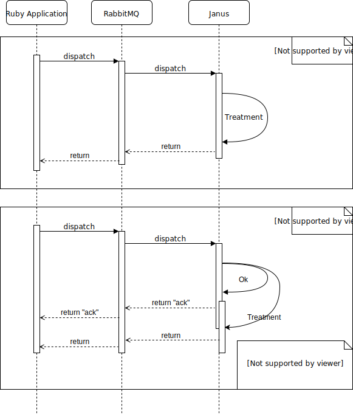

# Ruby RabbitMQ Janus
  [](https://github.com/dazzl-tv/ruby-rabbitmq-janus/actions/workflows/rspec.yml)
  [](https://github.com/dazzl-tv/ruby-rabbitmq-janus/actions/workflows/linter.yml)
  [](https://badge.fury.io/rb/ruby_rabbitmq_janus)
  [](https://inch-ci.org/github/dazzl-tv/ruby-rabbitmq-janus)
  [](https://codeclimate.com/github/dazzl-tv/ruby-rabbitmq-janus/maintainability)
  [](https://codeclimate.com/github/dazzl-tv/ruby-rabbitmq-janus/test_coverage)
  [](https://snyk.io/test/github/dazzl-tv/ruby-rabbitmq-janus)

Ruby Gem for Janus WebRTC Gateway integration using RabbitMQ message queue

This gem is used to communicate to a server Janus through RabbitMQ software
(Message-oriented middleware). It waiting a messages to Rails API who send to
RabbitMQ server in a queue for janus server. janus processes a message and send
 to RabbitMQ server in a queue for gem. Once the received message is decoded
 and returned through the Rails API.

This gem is product by [Dazzl.tv](http://dazzl.tv)



## Menu

* [How to use](#how-to-use)
  * [Installation](#installation)
  * [Requirements](#requirements)
  * [Configuration](#configuration)
    * [Janus](#janus)
    * [Generators](#generators)
    * [Requests](#requests)
  * [Usage](#usage)
    * [Information](#usage-information)
    * [Standard request](#standard-request)
    * [Admin request](#admin-request)
    * [Listen Janus Event](#listen-janus-event)
* [Upgrade](#upgrade)
* [Development](#development)
  * [RSpec](#rspec-test)
  * [Documentation](#documentation)
    * [Read documentation](#read-documentation)
    * [Generate developer documentation](#generate-developer-documentation)
* [Contributing](#contributing)

## How to use

### Installation

Use rubygem for installing gem in your application. Add in your Gemfile :

```ruby
gem 'ruby_rabbitmq_janus'
```

And then execute :

```linux
bundle
```

Or install it yourself as :

```linux
gem install ruby_rabbitmq_janus
```

Install basic configuration :

```linux
rails g ruby_rabbitmq_janus:install
```

### Requirements

* Janus Gateway : minimum version `0.7.4` [Source Code](https://github.com/meetecho/janus-gateway) - [Documentation](https://janus.conf.meetecho.com/docs/)
* RabbitMQ server

### Configuration

If you want used a customize configuration see [ruby-rabbitmq-janus.yml](config/default.md)

#### Janus

Configure one (or many) Janus server.
[See janus gateway documentation.](https://janus.conf.meetecho.com/docs/)

Configure the queue with rabbit with incremental number. So the first instance
take a name `to-janus-1` and all queues `from` sending in same queue.

#### Generators

Use generator for complete installation :

```ruby
rails g -h
RubyRabbitmqJanus:
  ruby_rabbitmq_janus:configuration     # Generate a custom configuration file.
  ruby_rabbitmq_janus:create_request    # Create an request to json format for RubyRabbitmqJanus transaction.
  ruby_rabbitmq_janus:default_request   # Copy base request file sending to janus in application.
  ruby_rabbitmq_janus:initializer       # Generate a initializer to this gem for rails application.
  ruby_rabbitmq_janus:install           # Install RubyRabbitmqJanus in your Rails application
```

#### Requests

For create an new request is simple. Use a command generator :

```ruby
rails g ruby_rabbitmq_janus:create_request test info 'transaction:<string>,body:{plugins:false}'
      create  config/requests/test/info.json
```

For more explain in requests files see [default requests](config/requests.md).

### Usage

#### Usage information

This gem use rabbitmq for manage request sending to Janus, so see
[documentation Janus](https://janus.conf.meetecho.com/docs/pages.html) and
[documentation Rabbitmq](http://www.rabbitmq.com/documentation.html). This gem
use bunny gem for create connection with rabbitmq. See many guide :
[bunny documentation](http://rubybunny.info/articles/guides.html).

#### Standard Request

```ruby
require 'ruby_rabbitmq_janus'

# Initialize standard object
t = RubyRabbitmqJanus::RRJ.new

# Ask info Janus Instance
t.session_endpoint_public do |transaction|
  transaction.publish_message('base::info')
end

=> @request={"janus"=>"server_info" ... }
```

#### Admin Request

__NOTE: The request authentication `HMAC-Signed token authentication` is not available.__

```ruby
require 'ruby_rabbitmq_janus'

# Initialize admin object
t = RubyRabbitmqJanus::RRJAdmin.new

# Ask info sessions in Janus Instance
options = { instance: 42 }
t.admin_endpoint(options) do |transaction|
  transaction.publish_message('admin::sessions', options)
end

=> @request={"janus"=>"success" ... "sessions"=>[123, 456, 789]}
```

#### Listen Janus Event

```ruby
require 'ruby_rabbitmq_janus'

# Create a class in your Rails application
actions = RubyRabbitmqJanus::ActionEvents.new.action

# Initialize a thread for listen public queue and send class to thread
RubyRabbitmqJanus::Janus::Concurrencies::Event.new.run(@actions)
```

#### Listen Janus Admin Event

```ruby
require 'ruby_rabbitmq_janus'

# Create a class in your Rails application
actions = RubyRabbitmqJanus::ActionAdminEvents.new.action

# Initialize a thread for listen public admin queue and send class to thread
RubyRabbitmqJanus::Janus::Concurrencies::EventAdmin.new.run(@actions)
```

## Upgrade

For upgrade your application read [CHANGELOG.md](CHANGELOG.md)

## Development

### RSpec test

__Use docker for running SPEC__

```linux
# Prepare images
docker-compose build

# Launch tiers service RabbitMQ
docker-compose up -d rabbit

# Launch tiers service Janus (ensure rabbit is started before and READY)
docker-compose up -d janus janus_token

## Excute ##

# Start for MongoID database
docker-compose run gem env MONGO=true bundle exec rake classic
docker-compose run gem env MONGO=true bundle exec rake concurrency

# Start for SQlite3 database
docker-compose run gem env MONGO=false bundle exec rake classic
docker-compose run gem env MONGO=false bundle exec rake concurrency

## OR ##

# Navigate in container an
docker-compose run gem ash
export MONGO=true
bundle exec rake classic
```

NOTE : Use `SPEC_DEBUG=true bundle exec rake classic` for stopping rspec execution when first test fail.

TIPS: for rspec install janus and rabbitmq server configured by default for user
rabbitmq and use plugin echotest for janus server.

Use tags for rspec :

| Describe                                                      | Type            | Name              |
| ------------------------------------------------------------- | --------------- | ---------------   |
| Internaly function                                            | config          |                   |
| Use bunny gem                                                 |                 | rabbit            |
| Test log functions                                            |                 | log               |
| Test configuration function                                   |                 | config            |
| Test Gem contains CONSTANTS                                   |                 | describe          |
| Level request sending to janus (admin monitor API or classic) | level           |                   |
| Request basic.                                                |                 | base              |
| Request with admin right in Janus application.                |                 | admin             |
| Request candidate/jsep                                        |                 | peer              |
| Request JSON sending to Rabbitmq -> Janus                     | request         |                   |
| Test request attach type                                      |                 | attach            |
| Test request type create                                      |                 | create            |
| Test request type detach                                      |                 | detach            |
| Test request type janus info                                  |                 | info              |
| Test request type test                                        |                 | test              |
| Test request type handle list                                 |                 | handles           |
| Test request type sesssion list                               |                 | sessions          |
| Test request type handle information                          |                 | handle_info       |
| Test request type (un)locking debug                           |                 | set_locking_debug |
| Test request type change log level                            |                 | set_log_level     |
| Test request type tokens list                                 |                 | tokens            |
| Test request type destroy session                             |                 | destroy           |
| Test request keepalive                                        |                 | keepalive         |
| Test request type sdp offer                                   |                 | offer             |
| Test request type trickle, send on candidate                  |                 | trickle           |
| Test request type trickles, send array candidate              |                 | trickles          |
| Event(s) thread                                               | event           |                   |
| Test thread public queue                                      |                 | event             |
| Test thread admin queue                                       |                 | event_admin       |

Example usage rspec with tags :
```ruby
rspec --tag --name:config --tag level:base
```

### Documentation

#### Read documentation

The documentation is accessible in [rubydoc](http://www.rubydoc.info/gems/ruby_rabbitmq_janus/)

#### Generate developer documentation

This doc is generated with yard.

```
# Genereate doc
yard
# Launch server
yard server
```

[See Yard Getting Started](http://www.rubydoc.info/gems/yard/file/docs/GettingStarted.md)

## Contributing

Bug reports and pull requests are welcome on GitHub at
https://github.com/dazzl-tv/ruby-rabbitmq-janus This project is intended to be a
safe, welcoming space for collaboration, and contributors are expected to adhere
to the [Contributor Covenant](http://contributor-covenant.org) code of conduct.
